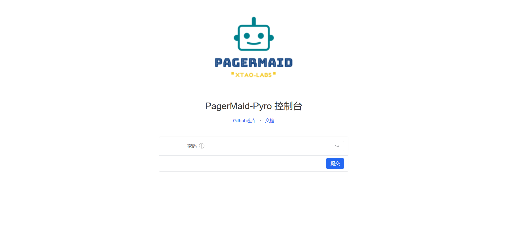
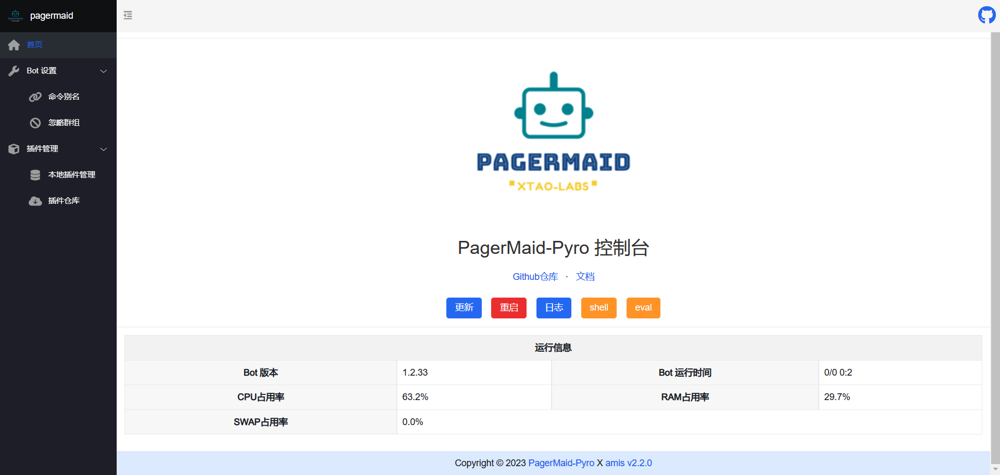
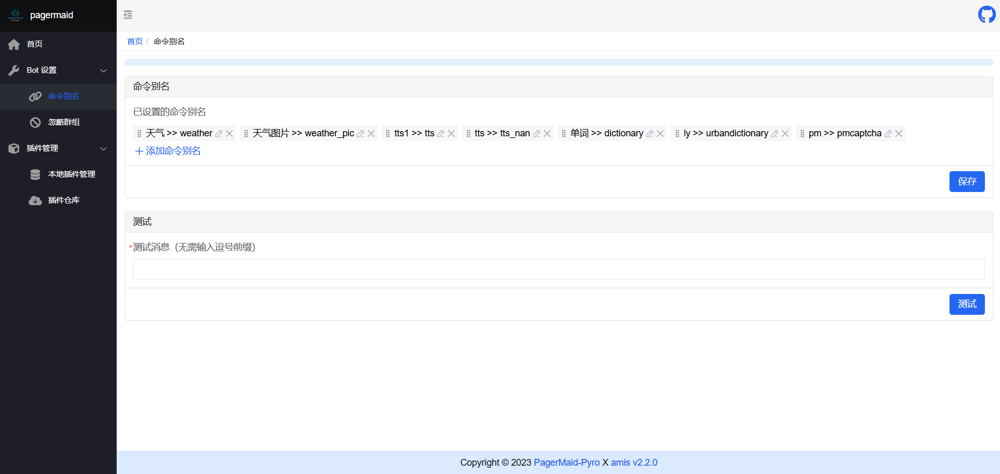
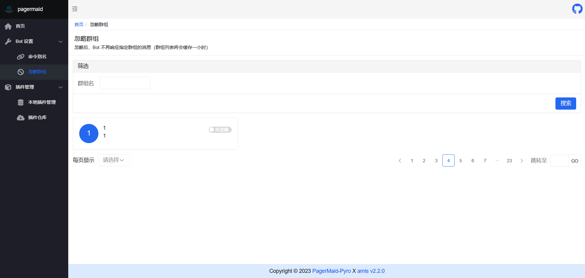
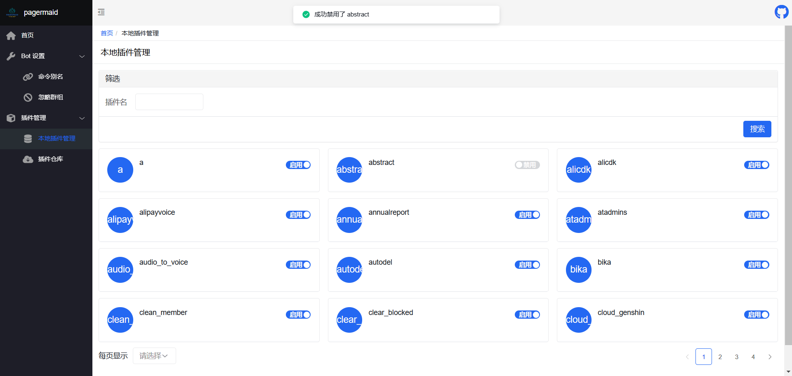
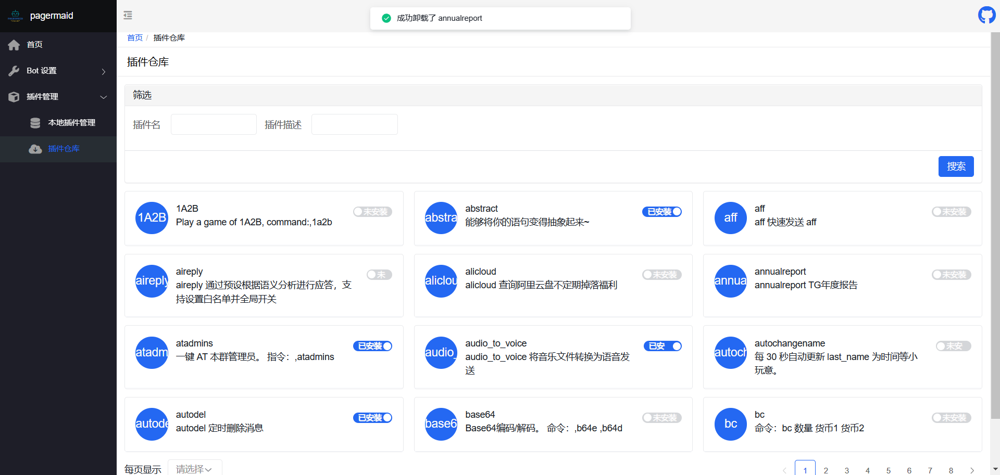

# 开始使用网页控制台



## 说明

从 PGP 的 `1.3.0` 版本开始，我们支持通过网页控制台管理机器人的插件和一些设置，未来也会在控制台中添加更多功能。

网页控制台的默认地址为： [http://127.0.0.1:3333](http://127.0.0.1:3333)

## 功能

### 查看日志、重启、更新



### 命令别名管理



### 忽略群组管理



### 本地插件管理



### 插件仓库管理



## 开启控制台

### 非 Docker 用户

请找到 PGP 的配置文件 `config.yml` ，修改为如下值

```yaml
web_interface:
  enable: "True"
  secret_key: "控制台密码"
  host: "127.0.0.1"
  port: "3333"
  origins: ["*"]
```

### Docker 用户

由于 docker 需要进行端口映射，你需要使用 [docker-compose.yml](https://github.com/TeamPGM/PagerMaid-Pyro/blob/master/docker-compose.gen.yml) 进行手动部署

这是一个配置文件例子

```yaml
version: "2.0"
services:
  pagermaid:
    image: teampgm/pagermaid_pyro
    restart: always
    container_name: pagermaid
    hostname: pagermaid
    ports:                 # 开启网页控制面板
      - "3333:3333"
    volumes:
      - ./:/pagermaid/workdir
    environment:
      - WEB_ENABLE=true
      - WEB_SECRET_KEY=控制台密码
      - WEB_HOST=0.0.0.0
      - WEB_PORT=3333
```
