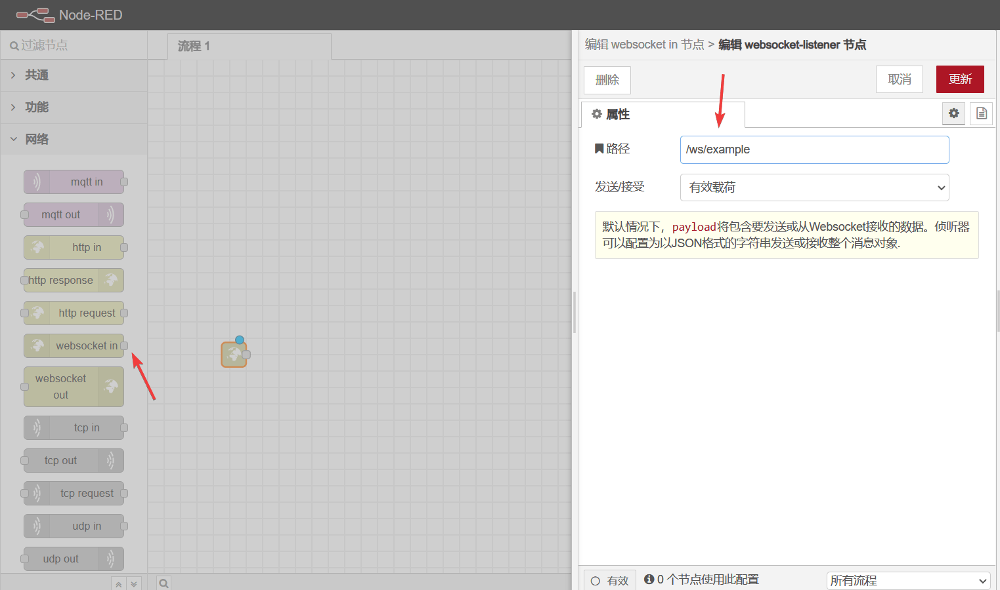
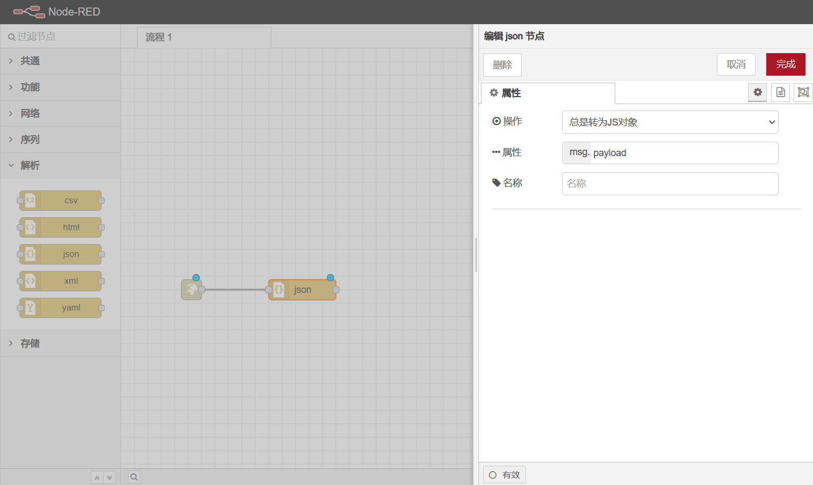
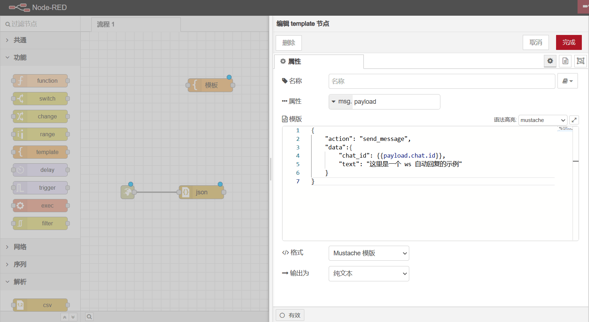

# 使用 ws 开始连接世界

## Node-RED 是什么

Node-RED 是一种基于流程的编程工具，由 IBM 的新兴技术服务团队原创开发，现在归属于 JS 基金会。

基于 Node-RED ，你可以添加许多模块模块，与我的世界，智能家居等其他领域实现联动！

## 开始之前

在使用 Node-RED 之前，你需要先在 PagerMaid-Pyro 中安装 `websocket` 插件，插件的目的在于与 Node-RED 实现通讯

## 安装 Node-RED

[安装方法](https://nodered.17coding.net/docs/getting-started/installation)

[Install](https://nodered.org/docs/getting-started/local)

## 添加 websocket 监听节点

运行 Node-RED 之后，你需要将 `网络 - websocket in` 拖动到流程 1 的界面中，并且双击它，以此来添加新的 `websocket-listener` 节点

### 连接到 ws

假设你添加的节点路径为 `/ws/example`

那么你需要在 PagerMaid-Pyro 中运行 `,websocket ws://127.0.0.1:1880/ws/example` 来让 userbot 连接到 Node-RED

## 添加 websocket 输出节点

你只需要将 `网络 - websocket out` 拖动到流程 1 的界面中，并且双击它，选择上一步添加好的 websocket 路径即可

## 解析输入

PagerMaid-Pyro 将收到的消息实时以 json 格式传递给 Node-RED ，所以你还需要添加一个 json 解析器，将其转换为 JS 对象

## 调用 userbot 方法

[pyrogram 文档](https://docs.pyrogram.org/api/methods/index.html)

你需要使用 `功能 - template` 传回 json 格式的文本，action 值为方法名，data 值为方法参数的字典。

## 开始自动化

在编辑流程完毕后，你需要使用 `部署` 按钮应用更改。

## 一些例子

请参考 [GitHub 仓库](https://github.com/TeamPGM/PagerMaid-Node-RED)
